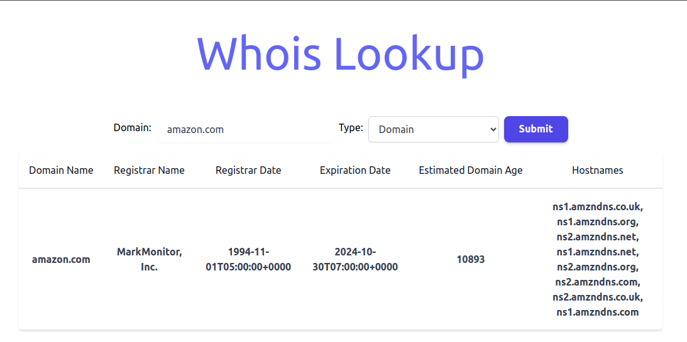

## Description
**Title**: WhoIs Lookup

**Objective**: Implement a full-stack application that includes both backend and frontend components.
It provides comprehensive information about domain names including
details about domain registration ownership and contact information.


## Using Third Party
The Whois API is a service that provides comprehensive information about domain names

https://www.whoisxmlapi.com/whoisserver/WhoisService

## Structure
    Backend : whois-backend(NestJs)
    Frontend : whois-frontend(React + Vite)

## Configure WhoIs API

whois-frontend/.env

```
WHOIS_API_KEY=
```

## Running the app

```bash
# 
$ cd whois-backend
$ npm install
$ npm run start

$ cd whois-frontend
$ npm install
$ npm run dev
```

You can see backend is running on http://localhost:3000, and frontend is running on http://localhost:5000

Have a look on http://localhost:5000
